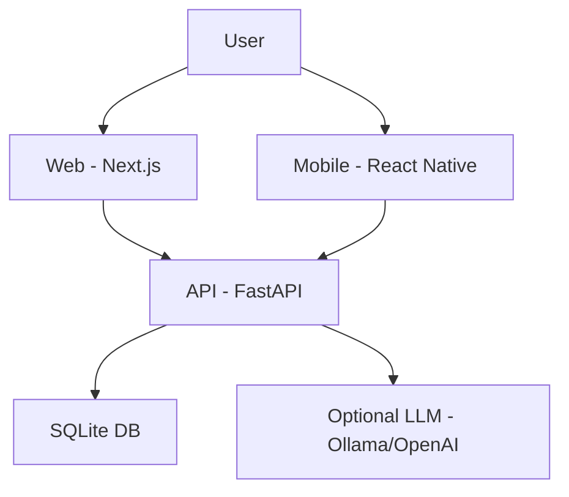

# 🚀 HumanBridge Suite

> Universal AI-powered tools to simplify bureaucracy and enhance guided learning.

---

## 📌 Overview
HumanBridge Suite is a production-ready monorepo containing two MVP products:

- 🧾 **BridgeForm** — Universal bureaucracy translator  
- 📚 **ReadBuddy** — AI-powered reading tutor  

Designed for rapid deployment, scalability, and real-world usability.

---

## 🏗️ Architecture



---

## ⚙️ Tech Stack

| Layer     | Technology |
|----------|------------|
| API      | FastAPI + SQLite |
| Web      | Next.js (App Router) |
| Mobile   | React Native (Expo Router) |
| Optional | Ollama / OpenAI |

---

## 📁 Project Structure

```text
humanbridge-suite/
├─ api/
├─ web/
├─ mobile/
├─ docs/
├─ sample-data/
└─ docker-compose.yml
```

---

## ⚡ Quick Start

### 1. API
```bash
cd api
python -m venv .venv
.venv\Scripts\activate   # Windows
source .venv/bin/activate  # Linux/macOS
pip install -r requirements.txt
copy .env.example .env
uvicorn app.main:app --reload --port 8000
```

### 2. Web
```bash
cd web
copy .env.local.example .env.local
npm install
npm run dev
```

### 3. Mobile
```bash
cd mobile
copy .env.example .env
npm install
npx expo start
```

---

## 🐳 Docker Setup

```bash
docker compose up --build
```

Access:
- API → http://localhost:8000  
- Docs → http://localhost:8000/docs  
- Web → http://localhost:3000  

---

## 🧪 Test Scenarios

### BridgeForm
- Upload or paste bureaucratic text  
- Click **Analyze Document**  
- Receive simplified output  

### ReadBuddy
- Create a reading profile  
- Input expected text  
- Input spoken transcription  
- Get accuracy + feedback  

---

## 🔌 API Endpoints

```text
GET  /api/v1/health
POST /api/v1/bureaucracy/analyze-text
POST /api/v1/bureaucracy/analyze-file
POST /api/v1/readbuddy/profiles
GET  /api/v1/readbuddy/profiles
GET  /api/v1/readbuddy/profiles/{id}
GET  /api/v1/readbuddy/profiles/{id}/sessions
POST /api/v1/readbuddy/analyze-reading
```

---

## 🧠 LLM Integration (Optional)

Supports:
- Ollama (local)
- OpenAI-compatible APIs

Environment example:

```env
OLLAMA_BASE_URL=http://localhost:11434
LLM_MODEL=phi4
```

---

## 🔍 OCR Support

- Uses **Tesseract OCR**
- Required only for image uploads  
- PDF, TXT, DOCX work natively  

---

## 📦 Roadmap

- [ ] PostgreSQL + pgvector
- [ ] Multi-tenant support
- [ ] Authentication (JWT)
- [ ] Real-time feedback (WebSocket)
- [ ] Analytics dashboard

---

## ⚠️ Disclaimer

For educational and prototyping purposes.  
Ensure compliance before production use (health, education, sensitive data).

---

## 📄 License

MIT (recommended — adjust if needed)

---

## 👨‍💻 Author

**Nielsen Castelo**  
AI Engineer | Data Scientist | Builder | PhD